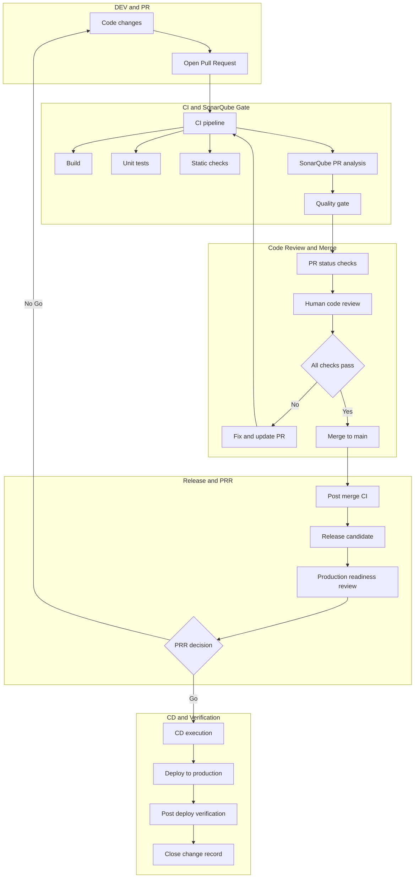

# End-to-end Flow (with PRR Gate Before CD)

This document describes the **end-to-end delivery flow** from code changes to production deployment, including:

- CI + SonarQube PR analysis
- Human code review
- Release Candidate (RC) formation
- **Production Readiness Review (PRR)** as a hard gate before CD
- Auditability via code review records

---

## Logical Flow (People + Gates)

```
Code (feature branch)
  ↓
Pull Request opened (Draft → Ready)
  - Link Work Item / Change Record
  - PR template filled (risk tier, how-to-test, rollout/rollback)
  ↓
CI Validation (single pipeline)
  - Build
  - Unit tests + coverage
  - Lint / format
  - SonarQube PR analysis (PR mode) + Quality Gate
  ↓
Human Code Review (Azure DevOps approvals)
  - 1–2+ reviewers (based on risk tier)
  - Review comments resolved
  ↓
Merge to main
  ↓
Post-merge CI (main)
  - Build artifacts (image/package)
  - Integration tests (if any)
  - Version tagging / release notes
  ↓
Release Candidate (RC) formed
  - Commit hash + artifacts immutable
  - Change record updated
  ↓
Production Readiness Review (PRR) Meeting ✅
  (Hard gate before CD)
  ↓
CD Execution (after PRR Go)
  - Deploy to staging / production (per policy)
  - Canary / blue-green / rolling
  - Feature flags if used
  ↓
Post-deploy Verification
  - Golden signals (latency, errors, traffic, saturation)
  - Business KPI sanity checks
  ↓
Close Change Record / Work Item
  - Capture PRR notes + metrics
```

---

## Production Readiness Review (PRR)

### Inputs (Evidence Pack)

- Code review record (PR link, approvals, resolved comments)
- SonarQube Quality Gate result (PR + main if required)
- Test evidence (unit / integration / E2E, coverage, key cases)
- Rollout plan + rollback plan
- Observability readiness (dashboards, alerts, logs, traces)
- Runbook + on-call ownership
- Dependency readiness (DB migration, feature flags, config)

### Outputs

- Go / No-Go decision
- Must-fix actions with owner and due time
- Final deployment window confirmation

---

## Actual Execution View

```
PR triggers CI pipeline (includes SonarQube PR analysis)
  → PR approvals
  → Merge to main
  → Main pipeline builds artifacts
  → Release Candidate (RC) created
  → PRR meeting reviews RC + PR evidence
  → If PRR = GO → CD pipeline promoted
```

---

## What “Code Review Record Included” Means

In PRR, the **PR itself becomes the audit artifact**.

You typically present:
- PR URL
- Reviewer list + approval timestamps
- Approval policy satisfied (e.g. 2 approvals for T2/T3)
- All comments resolved (or exceptions documented)
- CI + SonarQube quality gates passed
- Linked Work Item / Change Ticket

This forms the audit trail:
**“Who approved what, when, and based on which evidence.”**

---

## End-to-end Flow Diagram (Mermaid)


